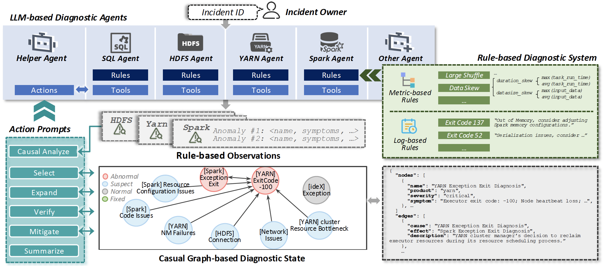

# ExpertDX: Harnessing Large Language Models for Generalized and Explainable Incident Management on Cloud Platforms

ExpertDX, a novel Large Language Model (LLM)-enhanced diagnostic framework, is introduced in this work. It is specifically designed to facilitate adaptive, explainable, and reliable reasoning toward generalized and explainable cloud incident management.



Key highlights of ExpertDX include:
1. **Expressive Explanations for LLM Diagnoses:** ExpertDX formulates LLM inference through the dynamic construction of an anomaly-granular causal graph, interpreting root cause analysis as a traversal through potential anomaly nodes. 

2. **Rigorous and Reliable Diagnostic Reasoning:** ExpertDX utilizes an Adaptive Graph-based Root Cause Search (AGRCS) algorithm that dissects the reasoning pathway into more focused and manageable diagnostic actions iteratively.

3. **Observation-Based Verification against Hallucinations:** ExpertDX deploys an observation-based self-verification mechanism by computing the evidence lower bound (ELBO), with an LLM decoder inversely estimating the likelihood of observed anomalies given inferred root causes.


These key features position ExpertDX as a powerful tool that delivers adaptable, explainable, and reliable solutions for incident management on cloud platforms.


## Getting Started

### Prerequisites

The project uses Python 3.10.

### Install Dependencies

To install the necessary libraries, run the following command:

```bash
pip install -r requirements.txt
```

### Configuration

Modify the `config/config.yaml` file to:
- Customize diagnostic `agents` for specific components of the cloud platform.
- Customize diagnostic `tools` for product-specific module agents.
- Adapt the `llm` interface to use the OpenAI GPT series, other APIs, or locally deployed models.


## Code Structure
The structure of the ExpertDX project is as follows:

- `config`: The project configuration file.
- `experiment.py`: The main script for running experiments.
- `expertdx`: The core code of the ExpertDX system, which includes:
  - `diagnostics`: Representations of `DiagnosticItem` and `DiagnosticState`.
  - `agents`: LLM-based agents, including `HelperAgent` and `ModuleAgent`.
  - `environments`: Adaptive Graph-based Root Cause Search (AGRCS) framework.
  - `verification`: ELBO and LLM-evaluation scripts and prompts.
  - `initialize.py`: Script to initialize the system.
  - `llms`: Interfaces for the Large Language Models.
  - `memory`: Memory for LLM-based Agent.
  - `message.py`: Defines the message class.
  - `plot.py`: Functions for plotting `DiagnosticState`.
  - `registry.py`: Registry for agents and tools.
  - `toolkit.py`: Toolkit for the LLM-based Agent.
  - `tools`: Tools for the LLM-based Agent.
  - `utils`: Utility scripts.

